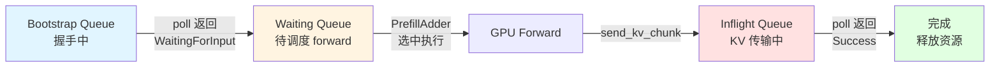
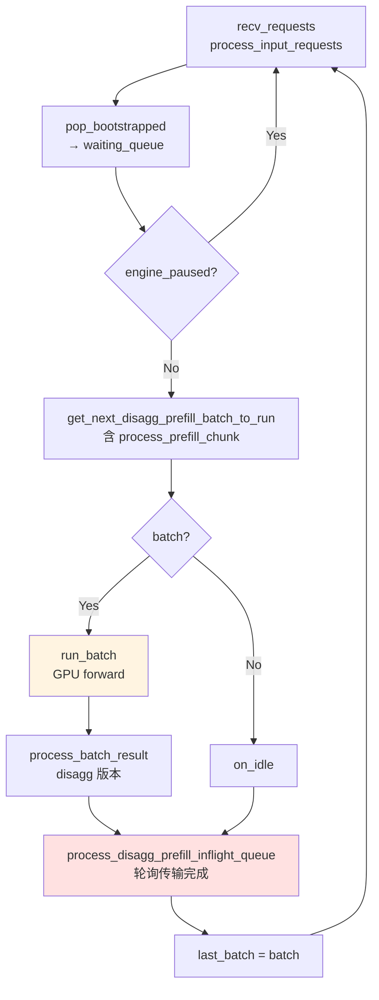
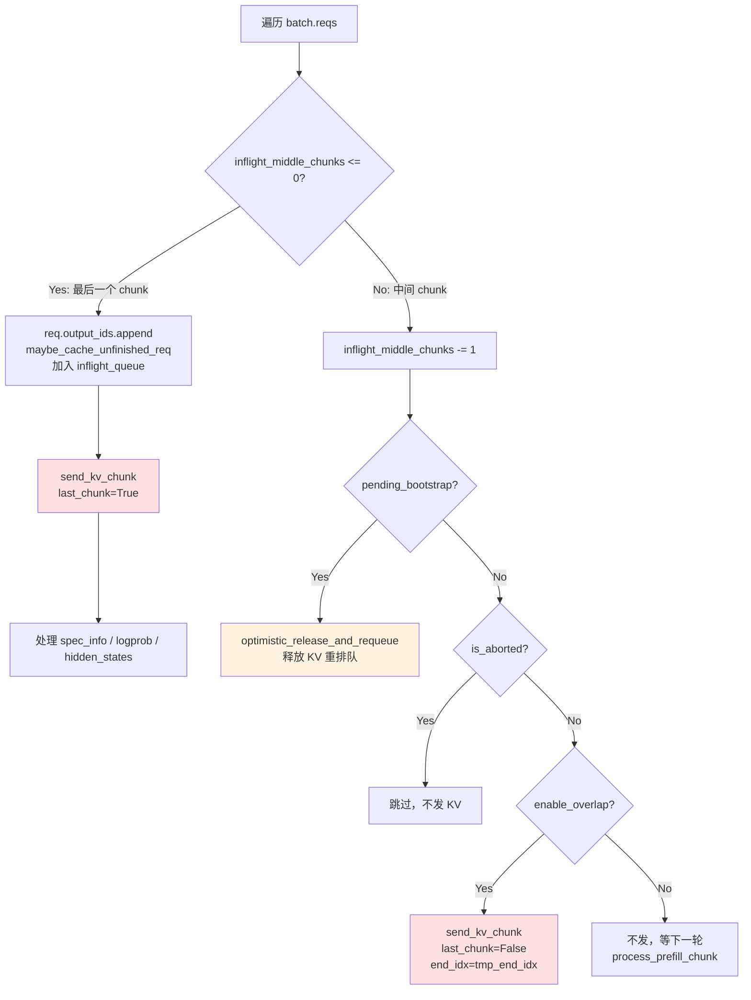
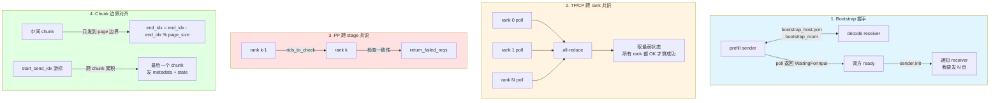
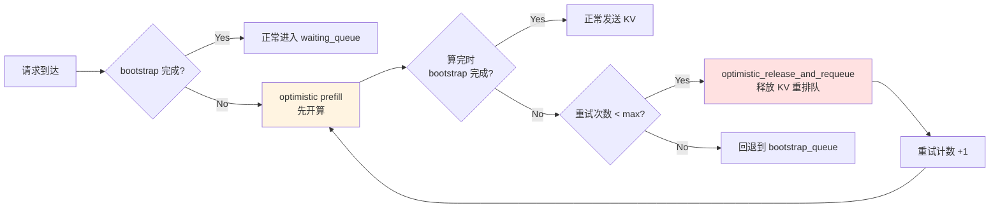
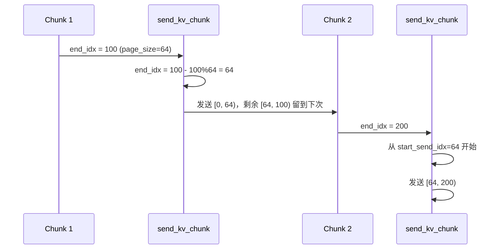

# SGLang PD 分离 Prefill 端 KV Cache 传输数据流

基于 `python/sglang/srt/disaggregation/prefill.py` 的分析。重点讲解 chunked prefill 的处理、同步机制、握手流程和 KV 传输。

## 1. 整体生命周期：三个队列

请求依次流过三个队列，**驱动方式是轮询（poll）而非回调**——这是理解整个同步模型的关键。



每个队列的职责：

| 队列 | 职责 | 驱动方式 |
|------|------|----------|
| **Bootstrap Queue** | 存储正在握手的请求，轮询 sender 状态 | `pop_bootstrapped()` 每 tick 调用 |
| **Waiting Queue** | 握手完成的请求，等待被调度执行 forward | `get_new_batch_prefill()` 选择 |
| **Inflight Queue** | forward 完成，KV 正在传输到 decode 端 | `process_disagg_prefill_inflight_queue()` 每 tick 轮询 |

---

## 2. Bootstrap（握手）阶段

### 2.1 入口：`PrefillBootstrapQueue.create_sender` (L226)

请求刚进来时：

1. 先检查是否超过 KV 容量（`_check_if_req_exceed_kv_capacity`，L291）
2. 根据 `transfer_backend`（Mooncake/NIXL/Mori/FAKE）实例化对应的 `KVSender`
3. sender 构造参数包括：
   - `bootstrap_addr`: `decode 端 host:port`
   - `bootstrap_room`: 一个房间号，decode 端也用同一个 room，**两边靠它配对**
   - `dest_tp_ranks=[tp_rank]`: prefill 的 tp_rank_i 只连 decode 的 tp_rank_i（TP 对 TP 直连）
4. 把 `max_new_tokens` 强制设为 1（L305）——因为 prefill 端只算 prefill，不真的生成，这样 `PrefillAdder` 的内存估算才准
5. 标记 `req.pending_bootstrap = True`

### 2.2 KVManager 初始化（`_init_kv_manager`，L147）

这是传输的"控制平面"。它收集：

- **KV data 指针/长度**：`token_to_kv_pool.get_contiguous_buf_infos()` 拿到 GPU 上连续 KV buffer 的基址，传输时只要传 page indices + 这些基址，receiver 就能 RDMA 读
- **Aux (metadata) 指针**：`metadata_buffers.get_buf_infos()`，用来传 logprob、采样结果等辅助信息
- **MLA 相关**：`kv_head_num`、`total_kv_head_num`、`mla_compression_ratios`（DeepSeek V4）
- **Page size**、IB 设备、PP/DP rank 等

如果开了 `SGLANG_DISAGG_STAGING_BUFFER`（非 MLA），还会把 `k_buffer/v_buffer` 张量引用传给 manager，让它在 GPU 上先 gather 再发（staging 模式）。

### 2.3 轮询握手：`pop_bootstrapped` (L307)

每个 scheduler tick 都会调它。核心动作：

```python
polls = poll_and_all_reduce_attn_cp_tp_group(
    [req.disagg_kv_sender for req in self.queue],
    self.scheduler.attn_cp_cpu_group,   # context parallel 组
    self.scheduler.attn_tp_cpu_group,   # tensor parallel 组
)
```

**这是第一个关键同步点**：TP/CP 多个 rank 各自 poll 自己的 sender，然后做一次 all-reduce 达成共识。为什么需要？因为 RDMA 连接是 per-rank 的，某个 rank 的链路可能单独失败；必须所有 rank 都 OK 才算 bootstrap 成功。

Poll 返回值（`KVPoll` 枚举）决定分支：

| Poll 状态 | 含义 | 处理 |
|-----------|------|------|
| `Failed` | 握手失败 | `handle_bootstrap_failure`，abort 请求 |
| `Bootstrapping` | 还在握手中，但已可重试 | 若重试次数未满且还有 metadata buffer → 加入 bootstrapped 列表（**乐观路径**） |
| `WaitingForInput` | 握手完成，decode 端已 ready | `finalize_bootstrap` 后加入 bootstrapped |

### 2.4 `finalize_bootstrap` (L262)

握手真正完成时：

1. **分配 metadata buffer index**（`ensure_metadata_buffer`）——这是一个 slot，后面用来传 logprob/topk 等辅助数据
2. 记录 `bootstrap_done_time`
3. **`pop_decode_prefix_len()`**：从 sender 拿 decode 端已经有的 prefix 长度（比如 prefix cache 命中时，decode 端可能已经有部分 KV）
4. 计算本次要发的 KV 长度：`num_kv_indices_to_send = len(origin_input_ids) - decode_prefix_len`
5. 转成页数：`num_pages = kv_to_page_num(num_kv_indices_to_send, page_size)`
6. 调 `sender.init(num_pages, metadata_buffer_index)` ——**这是告诉 receiver "我要发 N 页，metadata 在 slot M"**，receiver 据此预分配接收缓冲

完成后 `req.pending_bootstrap = False`，请求进入 Waiting Queue。

---

## 3. Scheduler 主循环

两种模式，逻辑等价，差别在 forward 与 result 处理是否 overlap：

### 3.1 Normal 模式：`event_loop_normal_disagg_prefill` (L416)



### 3.2 Overlap 模式：`event_loop_overlap_disagg_prefill` (L448)

- 用 `result_queue` 把 `run_batch` 和 `process_batch_result` 错开一个 tick
- 加了 `_war_barrier`（Write-After-Read barrier）防止共享 buffer（`req_to_token_pool`、SWA mapping）被前一轮 forward 还在写时就被下一轮覆盖
- `launch_batch_sample_if_needed` 提前 launch sample，让 sample 与下一次 schedule 重叠

---

## 4. Chunked Prefill 处理（核心）

这是最复杂的部分。一个长 prompt 会被切成多个 chunk 分批 forward，每个 chunk 完成后都要把对应的 KV 发给 decode 端。

### 4.1 `process_prefill_chunk` (L874) —— 处理"上一轮遗留的 chunked req"

```python
def process_prefill_chunk(self):
    chunked_req_to_exclude = set()
    if self.chunked_req:
        chunked_req_to_exclude.add(self.chunked_req)
        maybe_cache_unfinished_req(self.chunked_req, self.tree_cache, chunked=True)

        if not self.check_bootstrap(self.chunked_req):
            self.chunked_req = None          # bootstrap 还没好 / 失败 → 停掉这个 chunk
        elif self.enable_overlap:
            # overlap 模式：延迟到 process_batch_result 再发（因为结果还没 resolve）
            self.chunked_req.tmp_end_idx = min(
                self.chunked_req.fill_len, len(self.chunked_req.origin_input_ids)
            )
        else:
            self.send_kv_chunk(self.chunked_req)   # 普通模式：直接发
```

要点：

- `self.chunked_req` 是当前被切分、还没 prefill 完的请求
- 每个 chunk forward 完后先 `maybe_cache_unfinished_req(..., chunked=True)` 把已算的 KV 存到 radix tree
- **`check_bootstrap`**（L860）：如果这个请求是"乐观 prefill"（bootstrap 还没完就先开算了），这里再 poll 一次。失败则释放并 requeue；还在 bootstrapping 则 `optimistic_release_and_requeue`（L1005）；`WaitingForInput` 才真正 finalize
- **overlap vs normal**：overlap 模式下 KV 发送要等 sample 结果，所以这里只记录 `tmp_end_idx`，真正的 send 在 `process_batch_result_disagg_prefill` 里

### 4.2 `process_batch_result_disagg_prefill` (L497) —— batch forward 完成后

遍历 batch 里每个 req，按两种情况处理：



#### 情况 A：`req.inflight_middle_chunks <= 0`（最后一个 chunk，prefill 完成）

```python
req.output_ids.append(next_token_id)
maybe_cache_unfinished_req(req, self.tree_cache)
self.disagg_prefill_inflight_queue.append(req)
# ... 处理 spec_info / logprob / hidden_states ...
self.send_kv_chunk(req, last_chunk=True)   # ← 发最后一个 chunk
```

#### 情况 B：`req.inflight_middle_chunks > 0`（中间 chunk，还没完）

```python
req.inflight_middle_chunks -= 1

# overlap 模式下的 deferred release
if req.pending_bootstrap:
    self.optimistic_release_and_requeue(req)
    continue

# 被 abort 的 chunk 直接丢弃
if is_aborted(req):
    continue

# 处理中间 chunk 的 logprob（如果有）
if req.return_logprob: ...

# overlap 模式下：立即发中间 chunk（因为 tmp_end_idx 已设好）
if self.enable_overlap:
    self.send_kv_chunk(req, last_chunk=False, end_idx=req.tmp_end_idx)
```

**注意 normal 模式下中间 chunk 不发 KV**——它们会累积到 `process_prefill_chunk` 的下一轮里一起发（见 4.1 的 `self.send_kv_chunk(self.chunked_req)`）。

### 4.3 `send_kv_chunk` (L907) —— 真正发一个 chunk

```python
def send_kv_chunk(self, req, last_chunk=False, end_idx=None):
    page_size = self.token_to_kv_pool_allocator.page_size
    start_idx = req.start_send_idx
    end_idx = end_idx if end_idx is not None else min(req.fill_len, len(req.origin_input_ids))

    if not last_chunk:
        # 中间 chunk：末尾的部分页不发，留到下一次
        end_idx = end_idx - end_idx % page_size

    if end_idx < start_idx:
        return

    # 从 req_to_token_pool 拿这个 req 在 [start_idx, end_idx) 的 KV slot 索引
    kv_indices = self.req_to_token_pool.req_to_token[req.req_pool_idx, start_idx:end_idx]
                    .cpu().numpy()

    state_indices = None
    if last_chunk:
        self.disagg_metadata_buffers.set_buf(req)      # 写 metadata（logprob 等）
        seq_len = min(req.fill_len, len(req.origin_input_ids))
        # 根据 state_types 准备额外的 state 页：Mamba / SWA / DSA
        state_indices = [...]   # _mamba_payload / _swa_payload / _dsa_payload

    page_indices = kv_to_page_indices(kv_indices, page_size)
    if not req.disagg_kv_sender.should_send_kv_chunk(len(page_indices), last_chunk):
        return
    req.disagg_kv_sender.send(page_indices, state_indices)   # ← 真正发
    req.start_send_idx = end_idx                             # 推进游标
```

关键设计：

- **按页（page）对齐发送**：中间 chunk 只发到 page 边界，剩余的部分页等下一个 chunk 凑整再发。这样避免 receiver 收到半页导致对齐问题
- **`req.start_send_idx`** 是游标，记录"已经发到哪里了"
- **`last_chunk=True`** 时才发 metadata buffers 和 state（Mamba/SSM state、SWA 滑窗索引、DSA 索引）——这些只需要发一次
- **`kv_to_page_indices`** 把连续的 token 索引转成 page 索引（因为 RDMA 传输以 page 为单位）
- 实际 RDMA 写由 `sender.send()` 完成（具体实现在 `mooncake/`、`nixl/`、`mori/` 子目录）

---

## 5. Inflight 队列：等待传输完成

### `process_disagg_prefill_inflight_queue` (L670)

每个 tick 都轮询一次：

```python
polls = poll_and_all_reduce_attn_cp_tp_group(
    [req.disagg_kv_sender for req in self.disagg_prefill_inflight_queue],
    self.attn_cp_cpu_group,
    self.attn_tp_cpu_group,
)
```

**又是跨 TP/CP 的 all-reduce 共识**——所有 rank 的 sender 都报 Success 才算成功。

| Poll 状态 | 处理 |
|-----------|------|
| `WaitingForInput` / `Transferring` | 留在 inflight |
| `Success` | `release_kv_cache` 释放 radix tree 锁；`sender.clear()` 清理传输引擎数据；加入 `done_reqs`；记录 `kv_transfer_finish_time` |
| `Failed` | `sender.failure_exception()` 拿异常；`prepare_abort`；加入 `done_reqs` 但带错误 |

完成后：

- 对成功的请求收集传输 metric（latency、GB/s），更新 `metrics_reporter.kv_transfer_latency_ms` 等
- `output_streamer.stream_output(done_reqs, ...)` 把结果返回给客户端（**注意：PD 分离下 prefill 端返回的是"我算完了"，真正的 token 由 decode 端生成**）
- `maybe_release_metadata_buffer` 归还 metadata slot

---

## 6. 同步机制总览

整个流程里有 **4 层同步**：



### 6.1 Bootstrap 握手（prefill sender ↔ decode receiver）

- 通过 `bootstrap_host:bootstrap_port` + `bootstrap_room` 配对
- `poll()` 返回 `WaitingForInput` 表示双方都 ready
- `sender.init(num_pages, metadata_idx)` 是最后的"我要发了"通知

### 6.2 TP/CP 跨 rank 共识（prefill 内部）

- `poll_and_all_reduce_attn_cp_tp_group`：每个 rank 独立 poll，再 all-reduce 取最弱状态
- 防止"rank 0 成功但 rank 1 失败"的不一致

### 6.3 PP 跨 stage 共识（pipeline parallel 时）

- `rids_to_check` 参数：rank k+1 检查 rank k 报过来的 rid 列表
- `return_failed_reqs` 让 rank 0 能通知下游某个请求已失败

### 6.4 Chunk 边界对齐

- 中间 chunk 只发到 page 边界（`end_idx = end_idx - end_idx % page_size`）
- `start_send_idx` 游标跨 chunk 累积
- 最后一个 chunk 才发 metadata 和 state

---

## 7. 数据流一图流

```mermaid
flowchart TD
    Client[Client] -->|HTTP request| TM[TokenizerManager]
    TM -->|ZMQ| SCH[Scheduler<br/>prefill]

    SCH --> ①[① create_sender<br/>bootstrap 开始<br/>bootstrap_addr = decode_host:port<br/>bootstrap_room = 配对 ID]

    ① --> ②[② pop_bootstrapped<br/>每 tick 轮询<br/>poll_and_all_reduce_attn_cp_tp_group<br/>状态: Bootstrapping → WaitingForInput<br/>finalize_bootstrap:<br/>分配 metadata slot<br/>sender.init num_pages, metadata_idx]

    ② --> ③[③ 进入 waiting_queue<br/>被 PrefillAdder 选中<br/>如果 chunked: 切分 origin_input_ids]

    ③ --> ④[④ run_batch: GPU forward extend<br/>中间 chunk: maybe_cache_unfinished_req<br/>最后一个 chunk: maybe_cache_unfinished_req]

    ④ --> ⑤[⑤ process_batch_result_disagg_prefill<br/>中间 chunk: overlap 才立即 send_kv_chunk<br/>最后 chunk: send_kv_chunk last_chunk=True]

    ⑤ --> SEND[set_buf metadata<br/>准备 state_indices Mamba/SWA/DSA<br/>kv_to_page_indices<br/>sender.send page_indices, state_indices]

    SEND -->|RDMA write<br/>Mooncake/NIXL/Mori| DECODE[Decode 端 KV pool]

    SEND --> ⑥[⑥ req 进入 inflight_queue<br/>process_disagg_prefill_inflight_queue<br/>每 tick 轮询 sender]

    ⑥ --> SUCCESS[Success<br/>release_kv_cache<br/>stream_output]
    ⑥ --> FAILED[Failed<br/>prepare_abort]

    SUCCESS --> Client
    FAILED --> Client

    style ① fill:#e1f5ff
    style ② fill:#e1f5ff
    style ③ fill:#fff4e1
    style ④ fill:#fff4e1
    style ⑤ fill:#ffe1e1
    style ⑥ fill:#ffe1e1
    style DECODE fill:#e1ffe1
```

---

## 8. 关键设计点

### 8.1 Optimistic Prefill（乐观 prefill）

bootstrap 没完成就先开算，省时间。如果算完 bootstrap 还没好，就 `optimistic_release_and_requeue`（L1005）释放 KV 重排队，最多重试 `optimistic_prefill_retries` 次。这是延迟 vs 吞吐的折中。



### 8.2 Chunk 边界的部分页延迟发送

避免 RDMA 半页传输。代价是最多延迟 `page_size - 1` 个 token 的 KV。



### 8.3 Metadata buffer 与 KV 分离

KV 走 RDMA 大通道，logprob/topk/hidden_states 走专门的 metadata buffer（`disagg_metadata_buffers.set_buf`），两者在 receiver 端分别接收。

### 8.4 State 类型可扩展

Mamba (SSM)、SWA (滑窗)、DSA 都有专门的 state 索引准备逻辑，通过 `kv_args.state_types` 声明，未来加新 state 类型只要在 `send_kv_chunk` 里加一个分支。

### 8.5 PP 模式的特殊处理

`rids_to_check`、`return_failed_reqs`、`get_transferred_rids` 都是为 pipeline parallel 设计的——rank k 必须知道 rank k-1 的状态才能保持一致。

---

## 9. 关键函数速查表

| 函数 | 位置 | 职责 |
|------|------|------|
| `create_sender` | L226 | 创建 KV sender，初始化 bootstrap |
| `pop_bootstrapped` | L307 | 轮询 bootstrap 状态，返回已完成的请求 |
| `finalize_bootstrap` | L262 | 握手完成后分配 metadata slot，初始化 sender |
| `process_prefill_chunk` | L874 | 处理上一轮遗留的 chunked req |
| `process_batch_result_disagg_prefill` | L497 | batch forward 完成后处理结果，发送 KV |
| `send_kv_chunk` | L907 | 真正发送一个 chunk 的 KV 到 decode 端 |
| `process_disagg_prefill_inflight_queue` | L670 | 轮询传输完成状态，释放资源 |
| `handle_bootstrap_failure` | L806 | 处理 bootstrap 失败 |
| `optimistic_release_and_requeue` | L1005 | 乐观 prefill 失败时释放 KV 重排队 |
| `check_bootstrap` | L860 | 检查乐观 prefill 请求的 bootstrap 状态 |

---

## 10. 相关文件

- `python/sglang/srt/disaggregation/prefill.py` — 本文分析的主文件
- `python/sglang/srt/disaggregation/base/` — 基础类和接口定义
- `python/sglang/srt/disaggregation/common/` — 通用实现（CommonKVManager）
- `python/sglang/srt/disaggregation/mooncake/` — Mooncake 后端实现
- `python/sglang/srt/disaggregation/nixl/` — NIXL 后端实现
- `python/sglang/srt/disaggregation/mori/` — Mori 后端实现
- `python/sglang/srt/disaggregation/decode.py` — Decode 端接收逻辑
- `python/sglang/srt/managers/scheduler.py` — Scheduler 主循环（mixins 拆分）
